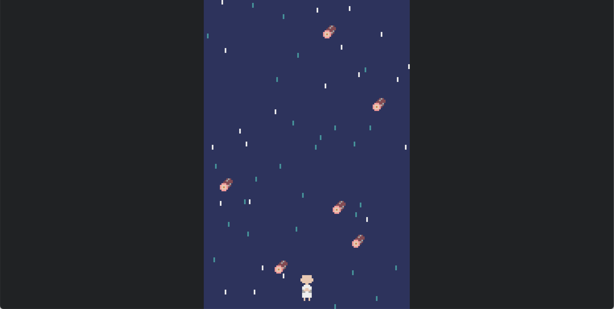

# 滝行シミュレータ
あなたは修行の身。

滝から流れてくる丸太を避けつつ、煩悩を打ち砕きましょう。

煩悩を打ち砕き続けば、いずれ悟りの境地へ至れるという噂が____

##

本ゲームには、Python用レトロゲームエンジンである、[Pyxel](https://github.com/kitao/pyxel.git)を使用しています。

ライセンス

MIT License

Copyright (c) 2018-2025 Takashi Kitao

This license applies to Pyxel - https://github.com/kitao/pyxel

Permission is hereby granted, free of charge, to any person obtaining a copy
of this software and associated documentation files (the "Software"), to deal
in the Software without restriction, including without limitation the rights
to use, copy, modify, merge, publish, distribute, sublicense, and/or sell
copies of the Software, and to permit persons to whom the Software is
furnished to do so, subject to the following conditions:

The above copyright notice and this permission notice shall be included in all
copies or substantial portions of the Software.

THE SOFTWARE IS PROVIDED "AS IS", WITHOUT WARRANTY OF ANY KIND, EXPRESS OR
IMPLIED, INCLUDING BUT NOT LIMITED TO THE WARRANTIES OF MERCHANTABILITY,
FITNESS FOR A PARTICULAR PURPOSE AND NONINFRINGEMENT. IN NO EVENT SHALL THE
AUTHORS OR COPYRIGHT HOLDERS BE LIABLE FOR ANY CLAIM, DAMAGES OR OTHER
LIABILITY, WHETHER IN AN ACTION OF CONTRACT, TORT OR OTHERWISE, ARISING FROM,
OUT OF OR IN CONNECTION WITH THE SOFTWARE OR THE USE OR OTHER DEALINGS IN THE
SOFTWARE.

## プレビュー

## プレイ用リンク
まだ実装できていない機能もいくつかありますが。
スコアをXにシェアできるようになりました。

https://tdtiger.github.io/Takigyo/app/takigyo.html

## 操作方法

|アクション | コマンド | 備考 |
| --- | --- | --- |
| 移動 | 左右スワイプ |  |
| 煩悩破壊 | タップ | |
| 無敵化 | 上スワイプ | ゲージ満タン時のみ |

## ルールなど
- 丸太に当たったらゲームオーバー
- ゲージが満タンの時に上スワイプで2秒間無敵
- 煩悩をタップすることでスコアを獲得
- 煩悩が画面外に落ちてしまうとゲージが減る